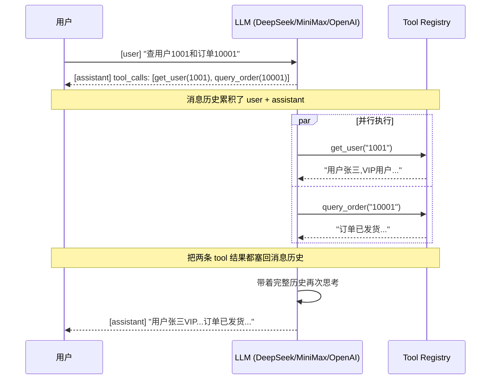

# LLM + Go Function Calling Demo

> 📚 对应学习计划：[docs/agent-learning/README.md](../../../docs/agent-learning/README.md)（Demo A：个人助理 Agent）
> 🗓️ 创建日期：Day 1 · Step 3 · 第一个 Agent Demo

## 🎯 学习目标

亲手跑通一个**最简但完整的 Agent 循环**，理解三件事：

1. **Function Calling 协议**：LLM 怎么决定调用哪个函数 + 怎么传参
2. **Agent Loop**：Tool 执行完结果怎么塞回消息历史 + 怎么循环直到 LLM 不再调工具
3. **Provider 抽象**：同一套代码如何同时跑 DeepSeek / MiniMax / OpenAI

> 💡 这是学习计划里的 **Demo A（个人助理 Agent）** 的 Go 实现版本，演示两个 mock 工具：`query_order` 和 `get_user`。

## 📁 文件清单

| 文件 | 作用 |
|------|------|
| `main.go` | 全部代码：provider 预设 + tool 注册 + agent 循环 |
| `go.mod` / `go.sum` | 依赖：`openai-go` SDK + `godotenv` |
| `.env` | API Key（**不要提交到 git**） |

## 🚀 怎么跑

### 1. 准备 API Key

```bash
cd code/06-agent/go-agent-demo

# 把下面这一行换成你真实的 key（至少配一个）
cat > .env << 'EOF'
DEEPSEEK_API_KEY=sk-your-deepseek-key
MINIMAX_API_KEY=sk-your-minimax-key
OPENAI_API_KEY=sk-your-openai-key
EOF
```

### 2. 切换 Provider

打开 `main.go`，找到这一行：

```go
provider := "minimax"   // ← 改成 "deepseek" / "openai" 即可
```

可选值：
- `"deepseek"` — 国产便宜，OpenAI 兼容协议
- `"minimax"` — MiniMax（默认）
- `"openai"` — OpenAI 官方

### 3. 跑起来

```bash
go run .
```

### 4. 改你的问题

```go
const promptMsg = "帮我查询用户1001，并查询他的订单10001"
//           ↑ 改成你想测试的任何自然语言问题
```

## 🧪 演示效果

### 输入 prompt

```
帮我查询用户1001，并查询他的订单10001
```

### 模型思考过程（你会在终端看到）

```
当前使用: provider=minimax, model=MiniMax-M3, baseURL=https://api.minimax.cn/v1
Tool: get_user
Result: 用户 1001 张三,VIP用户，账户状态正常
Tool: query_order
Result: 订单 10001 已发货，金额3999元，预计明天送达
Final Answer:
用户张三（ID 1001）是 VIP 用户，状态正常。他的订单 10001 已经发货，金额 3999 元，预计明天送达。
```

**注意一个细节**：LLM 在**同一次回复里并行触发了两个工具**，这就是 OpenAI Function Calling 的 `parallel_tool_calls` 能力。Agent Loop 里我们用 `for _, toolCall := range message.ToolCalls` 顺序处理（如果工具之间没有依赖，顺序不影响结果；如果有依赖，需要串行调用）。

## 🧠 核心代码解析

### 1. Provider 预设（多供应商切换的关键设计）

```go
presets := map[string]preset{
    "deepseek": { apiKeyEnv: "DEEPSEEK_API_KEY", baseURL: "https://api.deepseek.com", model: "deepseek-v4-flash" },
    "minimax":  { apiKeyEnv: "MINIMAX_API_KEY",  baseURL: "https://api.minimax.cn/v1", model: "MiniMax-M3" },
    "openai":   { apiKeyEnv: "OPENAI_API_KEY",    baseURL: "https://api.openai.com",  model: "gpt-4o-mini" },
}

// ★ 切换模型只需改这一行 ★
provider := "minimax"
```

> 💡 **设计要点**：用 `map[string]preset` 而不是 `if/else`，新增 provider 只要往 map 里加一行，业务代码 0 改动。

### 2. Tool 注册表（命令模式）

```go
type Tool struct {
    Name        string
    Description string
    Handler     func(args string) (string, error)
}

toolRegistry := map[string]Tool{
    "query_order": { ... },
    "get_user":    { ... },
}
```

然后用 `openai.ChatCompletionToolParam` 单独声明 schema（这就是发给 LLM 的「工具说明书」）：

```go
tools := []openai.ChatCompletionToolParam{
    { Function: openai.FunctionDefinitionParam{
        Name:        "query_order",
        Description: openai.String("查询订单信息"),
        Parameters: openai.FunctionParameters{
            "type": "object",
            "properties": map[string]any{
                "order_id": map[string]any{
                    "type":        "string",
                    "description": "订单号",
                },
            },
            "required": []string{"order_id"},
        },
    }},
}
```

> ⚠️ **当前实现的不足**：`tools` 数组和 `toolRegistry` 是分开维护的两份数据，新增工具要改两处。改进方向见 §进阶。

### 3. Agent Loop（核心中的核心）

```go
for {
    // 1. 把当前消息历史发给 LLM
    resp, _ := client.Chat.Completions.New(ctx, openai.ChatCompletionNewParams{
        Model:    p.model,
        Messages: messages,
        Tools:    tools,
    })

    message := resp.Choices[0].Message
    messages = append(messages, message.ToParam())   // 2. assistant 消息入历史

    if len(message.ToolCalls) == 0 {
        fmt.Println("Final Answer:", message.Content) // 3. 没工具调用 → 结束
        break
    }

    // 4. 有工具调用 → 执行每个 tool → 结果入历史 → 回到 1
    for _, toolCall := range message.ToolCalls {
        result, _ := toolRegistry[toolCall.Function.Name].Handler(toolCall.Function.Arguments)
        messages = append(messages, openai.ToolMessage(result, toolCall.ID))
    }
}
```

**这就是 ReAct 模式的最简实现**：

```
   ┌─────────────────────────────────┐
   │          用户输入                  │
   └─────────────┬───────────────────┘
                 ▼
   ┌─────────────────────────────────┐
   │ ① LLM 思考：要调什么工具？        │
   └─────────────┬───────────────────┘
                 ▼
            ┌────────────┐
       ┌────┤ 有 tool call?├────┐
       │    └────────────┘    │
      No                      Yes
       │                       │
       ▼                       ▼
   ┌────────┐        ┌─────────────────┐
   │ 结束   │        │ ② 执行工具拿结果  │
   └────────┘        └────────┬────────┘
                             ▼
                  ┌─────────────────────┐
                  │ ③ 结果塞回消息历史   │
                  └────────┬────────────┘
                           ▼
                       回到 ①
```

## 🔁 工作流程图（含消息历史）



## 🧪 你可以试的实验

### 实验 1：观察 Agent Loop 的多轮调用

把 `promptMsg` 改成：

```go
const promptMsg = "查用户1001，然后根据他的VIP等级推荐适合的商品"
```

观察：模型可能先调 `get_user`，拿到结果后再调第二个工具（或直接回答）。

### 实验 2：观察并行工具调用

保持原 prompt，观察两个工具是**串行还是并行**被触发的（看终端输出顺序）。

### 实验 3：故意制造模型幻觉

把 `query_order` 的描述改成 `"查询商品库存"`，看看 LLM 会不会把订单号传到错误的工具。

### 实验 4：换模型看差异

同一个 prompt，分别用 `deepseek` / `minimax` / `openai` 跑，对比：
- 谁会触发并行 tool call
- 谁更稳定
- 谁更省钱

## ⚠️ 已知不足 / 可改进点

| 问题 | 影响 | 改进方向 |
|------|------|---------|
| `tools` 和 `toolRegistry` 两份数据 | 新增工具要改两处 | 把 schema 也放进 `Tool` struct，运行时生成 `tools` |
| `Handler` 签名是 `func(args string)` | 每个 handler 都要自己反序列化 | 改成 `Handler func(args json.RawMessage)` 或用泛型 |
| 没有超时控制 | 网络卡住会一直等 | 加 `context.WithTimeout` |
| 没有重试 | 偶发网络抖动直接 fatal | 加指数退避 |
| 没有最大循环次数 | 模型可能死循环 | 加 `maxIterations` 计数器 |
| 错误处理 `log.Fatal` | 一个失败全盘结束 | 改成把错误信息作为 tool result 返回给 LLM，让它自己决定怎么办 |

### 🚀 进阶 Demo 方向（推荐下一步）

1. **加 max iterations**：在循环顶部加 `if i > 10 { break }`，防止死循环
2. **错误回流**：把 handler 的 err 包装成 `"ERROR: ..."` 字符串传给模型，让它自己判断
3. **加真实工具**：替换 mock 数据为真实 API（如 `queryOrder` 调用数据库 / `getUser` 调用户中心）
4. **接 LangSmith / 日志**：把每轮消息 dump 到文件，回放 Agent 决策过程
5. **加 memory**：用 LangGraph / 自己写一个 checkpointer，让对话能跨 turn 记住上下文

## ❓ 常见问题

**Q1: 为什么用 OpenAI SDK 也能调 DeepSeek / MiniMax？**  
A: DeepSeek 和 MiniMax 都提供 OpenAI 兼容协议，只要换 `baseURL` + `apiKey`，SDK 调用方式完全一样。这是 OpenAI 生态最大的优势。

**Q2: `tool_call.id` 一定要回传吗？**  
A: 必须。每个 tool result 都要带上对应的 tool_call.id，否则模型分不清这条结果是哪个工具的。

**Q3: 如果模型不调工具、直接回答怎么办？**  
A: 那就是 `len(message.ToolCalls) == 0` 的分支，循环直接结束，打印 final answer。这是正常路径，不是 bug。

**Q4: 为什么我的工具没被调用？**  
A: 几个常见原因：
- Description 写得太模糊，模型不知道什么时候用
- 参数描述不清楚
- 用户的问题本来就不需要工具
- 模型太弱（比如用了 mini 版），可以换更强的模型试试

**Q5: 并行调用工具安全吗？**  
A: **取决于工具是否有副作用**。`get_user` / `query_order` 这种纯读操作并行完全没问题；如果工具会修改状态（如下单、转账），必须串行执行。

## 📌 面试速记卡

如果你被问「怎么用 Go 写一个 Agent」，按这个答：

```
1. 用 OpenAI 兼容 SDK（openai-go / langchaingo）
2. 定义 Tool：name + description + JSON schema + handler
3. messages 数组维护对话历史（user / assistant / tool 三种 role）
4. Agent Loop：
   - 把 messages 发给 LLM
   - 如果返回 tool_calls → 执行每个 handler → 把结果作为 tool message 塞回 messages
   - 如果没 tool_calls → 打印 final answer，退出
5. 多 provider 切换：抽象 baseURL + apiKey + model 三个变量
```

**进阶加分项**：
- 提到 max iterations 防止死循环
- 提到 context.WithTimeout 控制超时
- 提到 tool result 错误回流让模型自愈
- 提到 LangGraph / AutoGen 等上层框架解决了哪些问题

## 🔗 相关资源

- 学习计划总览：[docs/agent-learning/README.md](../../../docs/agent-learning/README.md)
- OpenAI Function Calling 文档：https://platform.openai.com/docs/guides/function-calling
- openai-go SDK：https://github.com/openai/openai-go
- DeepSeek Function Calling：https://api-docs.deepseek.com/guides/function_calling
- Anthropic Tool Use：https://docs.anthropic.com/en/docs/tool-use

## 📜 版本历史

| 日期 | 改动 |
|------|------|
| Day 1 | 初版：单次调用 → 重构为 Agent Loop；mock 两个工具 |
| Day 1 | 增加 provider 预设，支持 deepseek / minimax / openai 三家切换 |
